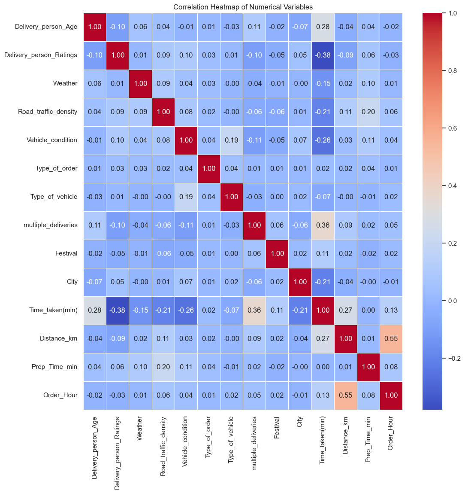
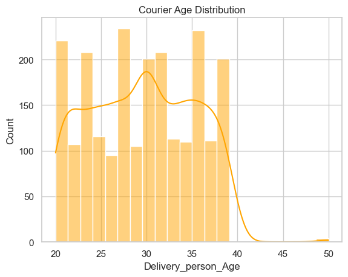
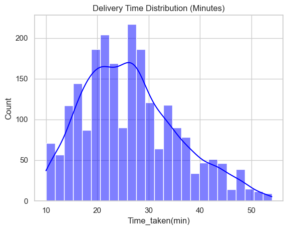
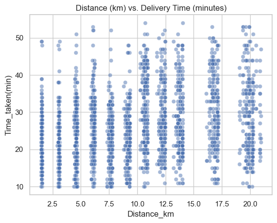
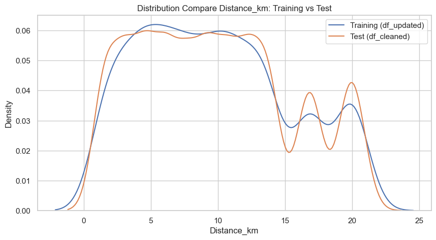
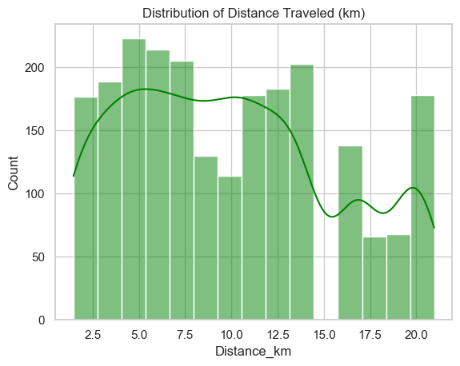
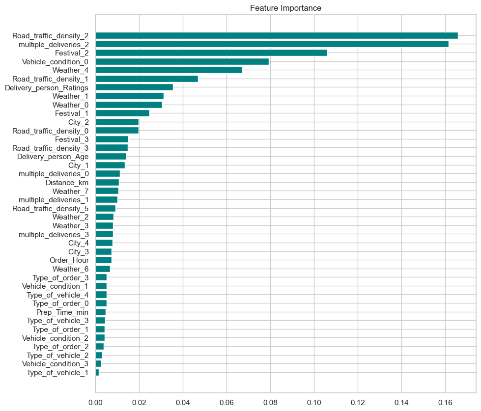
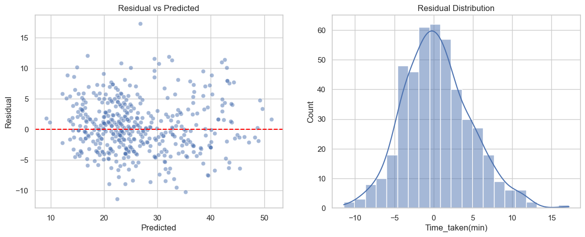
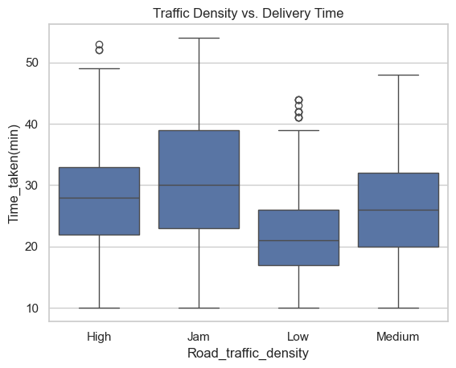

# Amazon Business Research Analyst Dataset — Delivery Time Analysis

This project performs **data cleaning, feature engineering, exploratory data analysis (EDA), and predictive modeling** on the Amazon Business Research Analyst Dataset (Kaggle) to understand and predict **courier delivery time**.

## Table of Contents
- [Business Understanding](#business-understanding)
- [Data Understanding](#data-understanding)
- [Data Cleaning & Feature Engineering](#data-cleaning--feature-engineering)
- [Exploratory Data Analysis (EDA)](#exploratory-data-analysis-eda)
- [Predictive Analysis](#predictive-analysis)
- [Applying the Model to the Test Set (df_cleaned)](#applying-the-model-to-the-test-set-df_cleaned)
- [Project Structure](#project-structure)
- [How to Run](#how-to-run)

---

## Business Understanding

### Background
Accurate delivery time estimation (Estimated Time of Arrival / ETA) is one of the key factors influencing customer satisfaction in on-demand food/goods delivery services. An overly optimistic estimate disappoints customers, while an overly conservative one makes the platform look less efficient compared to competitors.

### Problem Statement
1. Which factors (distance, weather, traffic, number of simultaneous orders, etc.) most influence delivery duration?
2. What patterns/insights from historical delivery data can inform operational decisions (e.g., courier allocation, ETA adjustments during bad weather/heavy traffic)?
3. Can delivery time be accurately predicted using historical courier, order, and location data?

### Objectives
1. Clean and prepare the raw data so it is fit for analysis.
2. Extract insights on delivery time patterns through EDA (univariate, bivariate, correlation analysis).
3. Build a regression model to predict `Time_taken(min)` based on courier, order, weather, traffic, and distance features.
4. Apply the model to the unlabeled test data (`df_cleaned`) as a simulation of inference on new data.

### Benefits
- **Operational:** helps courier scheduling and allocation based on the factors most associated with delays.
- **Customer experience:** more accurate ETAs to display to customers.
- **Strategic:** identifies conditions (weather, traffic, festivals) that need special mitigation.

---

## Data Understanding

The dataset is sourced from the **Amazon Business Research Analyst Dataset** (Kaggle), with three raw files under `raw_data/`:

| File | Description |
|---|---|
| `cleaned_test.csv` | Delivery data with categories in **string/label** form. Based on its naming, this is likely a **test set** — it has no `Time_taken(min)` target column |
| `encoded_cleaned_test.csv` | The same data as `cleaned_test.csv`, but with categories already in **numeric code** form, also without a target |
| `updated.csv` | A dataset with a similar column structure **that includes `Time_taken(min)`**, used as the training data. Its categories are decoded using a mapping (`decoding_maps`) built by matching `ID` between `cleaned_test.csv` and `encoded_cleaned_test.csv` |

### Main Columns (before feature engineering)
`ID`, `Delivery_person_ID`, `Delivery_person_Age`, `Delivery_person_Ratings`, restaurant & delivery location coordinates, `Order_Date`, `Time_Orderd`, `Time_Order_picked`, `Weather`, `Road_traffic_density`, `Vehicle_condition`, `Type_of_order`, `Type_of_vehicle`, `multiple_deliveries`, `Festival`, `City`, and `Time_taken(min)` (only present in `updated.csv`).

### Data Size
| Stage | Row count |
|---|---|
| Raw `cleaned_test.csv` / `encoded_cleaned_test.csv` | 11,399 |
| After filtering invalid coordinates (0,0) | 10,529 |
| Raw `updated.csv` | 2,442 |
| After cleaning & coordinate filtering (`df`, used for modeling) | **2,266 rows, 13 features + 1 target** |

### Data Quality Issues Found
- Missing values in `Delivery_person_Age`, `Delivery_person_Ratings`, `multiple_deliveries`, `Time_Orderd`, `Weather`, `Road_traffic_density`, `Festival`, `City`.
- Negative location coordinates (sign input error) and several rows with invalid `(0,0)` coordinates.
- `Delivery_person_Age` recorded as `0` in some rows (anomaly/placeholder, not a real age).
- Inconsistent `Time_Orderd` and `Time_Order_picked` formats.
- An irrelevant `Name:` column, which was dropped.
- `cleaned_test.csv`/`encoded_cleaned_test.csv` **have no target column** — used as unlabeled test data, not for training/evaluation.

---

## Data Cleaning & Feature Engineering

1. **Missing value imputation** — numeric columns filled with **median**, categorical columns filled with **mode**.
2. **Coordinate fixes** — negative values converted to absolute; rows with `(0,0)` coordinates dropped.
3. **Courier age anomaly fix** — `Delivery_person_Age = 0` replaced with the median of valid courier ages.
4. **`Distance_km`** — computed from restaurant & delivery location coordinates using the **Haversine formula**.
5. **`Prep_Time_min`** — difference between `Time_Order_picked` and `Time_Orderd`, corrected by +1440 minutes when the result is negative (crossing midnight).
6. **`Order_Hour`** — the hour the order was placed, extracted from `Time_Orderd`.
7. **Category alignment** across the three data sources via `ID`-based mapping (`decoding_maps`), so that `Road_traffic_density`, `Weather`, etc. in `updated.csv` are consistent with the string labels in `cleaned_test.csv`.
8. Irrelevant columns (`ID`, `Delivery_person_ID`, raw coordinates, `Name:`, `Unnamed: 0`) were dropped from the final modeling dataset.

---

## Exploratory Data Analysis (EDA)

### 1. Correlation Heatmap


**Insight:**
- `Time_taken(min)` correlates most positively with `multiple_deliveries` (**0.36**) and `Delivery_person_Age` (**0.28**), and most negatively with `Delivery_person_Ratings` (**−0.38**) and `Vehicle_condition` (**−0.26**).
- `Road_traffic_density` (−0.21) and `City` (−0.21) also contribute, indicating that traffic context and region meaningfully affect delivery duration.
- A fairly high collinearity was found between `Distance_km` and `Order_Hour` (**0.55**) — certain ordering hours tend to be associated with longer distances, which should be considered when using linear models.
- Most other features (`Type_of_order`, `Prep_Time_min`) show very weak correlation (~0.00–0.02) with the target — suggesting a small individual relationship, though they may still contribute through non-linear interactions (see feature importance).

### 2. Courier Age Distribution


**Insight:**
- Courier age is concentrated in the **20–39** range, with a multimodal pattern (several local peaks around ages 22, 28, and 35–37) — possibly reflecting different courier recruitment waves.
- Couriers above age 40 are very rare, indicating the courier workforce is dominated by a young, productive-age group.

### 3. Delivery Time Distribution


**Insight:**
- Most deliveries are completed within **15–35 minutes**, peaking around 20–30 minutes.
- The distribution is slightly right-skewed — a portion of deliveries take 40–55 minutes, indicating delayed-delivery cases worth investigating further (traffic, festivals, long distances, etc).

### 4. Distance vs Delivery Time


**Insight:**
- Data points cluster into several distinct distance "bands" rather than a continuous spread, suggesting recorded distances take on a relatively limited/repeated set of values (likely due to a limited variety of location pairs in the dataset).
- At any given distance, delivery time still spans a wide range (10–50+ minutes) — confirming that **distance alone is not a strong single predictor**; other factors such as traffic and multiple deliveries also drive duration.

### 5. Distribution Compare: Distance_km Training vs Test


**Insight:**
- The shape of the `Distance_km` distribution in the training data (`df_updated`, 2,266 rows) and the test data (`df_cleaned`, 10,529 rows) is **very similar** — both are flat across the 3–13 km range and decline after 15 km.
- This similarity indicates the training data is **fairly representative** of the test set population in terms of distance, so a model trained on `df_updated` is reasonably applicable to `df_cleaned`.

### 6. Distribution of Distance Traveled (Test Set)


**Insight:**
- With the much larger `df_cleaned` sample, the multimodal distance pattern becomes clearer: a main concentration at 2.5–14 km, a gap around 15–16 km, then another cluster at 17–21 km.
- This two-cluster distance pattern (short vs. long) is consistent with the training data findings — reinforcing the idea of two distinct delivery "service zones" with different characteristics.

### 7. Feature Importance (Model)


**Insight:**
- The three most influential features for the model's predictions are heavy traffic condition (`Road_traffic_density_2` ≈ 0.166), a specific multiple-delivery load (`multiple_deliveries_2` ≈ 0.161), and festival periods (`Festival_2` ≈ 0.106).
- Interestingly, `Distance_km` and `Delivery_person_Age` — despite showing a noticeable linear correlation in the heatmap — have low importance (<0.02) in the model. This shows XGBoost relies more heavily on **categorical operational conditions** (traffic, festivals, order count) than on numeric distance/age attributes when making split decisions.

### 8. Residual Analysis


**Insight:**
- In the *Residual vs Predicted* plot, points are scattered fairly randomly around 0 without forming a clear funnel shape — indicating **no severe heteroscedasticity**; the model is reasonably stable across the range of predicted values.
- The residual distribution is close to normal and centered around 0, though there are a few outlier residuals up to +15–17 minutes — the model occasionally under-predicts significantly for certain cases (likely extreme condition combinations: heavy traffic + festival + multiple deliveries at once), which could be worth further investigation.

### 9. Traffic Density vs Delivery Time


**Insight:**
- The **"Jam"** category (heavy congestion) has the highest median delivery time (~30 minutes) and the widest interquartile range (IQR) — the least predictable condition.
- The **"Low"** category has the fastest median (~21 minutes) and the narrowest spread — the most consistent condition.
- The median delivery time order is: Jam > High > Medium > Low, consistent with business intuition and reinforcing why `Road_traffic_density` is the model's most important feature (see point 7).

### Correlation Analysis with the Target (summary)
| Feature | Correlation with `Time_taken(min)` |
|---|---|
| `multiple_deliveries` | +0.36 |
| `Delivery_person_Age` | +0.28 |
| `Distance_km` | +0.27 |
| `Order_Hour` | +0.13 |
| `Festival` | +0.11 |
| `Type_of_order` | +0.02 |
| `Prep_Time_min` | 0.00 |
| `Type_of_vehicle` | −0.07 |
| `Weather` | −0.15 |
| `Road_traffic_density` | −0.21 |
| `City` | −0.21 |
| `Vehicle_condition` | −0.26 |
| `Delivery_person_Ratings` | −0.38 |

---

## Predictive Analysis

### Model Setup
- **Target:** `Time_taken(min)`
- **Features:** 13 columns resulting from cleaning & feature engineering, one-hot encoded with `pd.get_dummies`.
- **Data split:** 80% train (1,812 rows) / 20% test (454 rows), `random_state=42`.
- **Preprocessing:** feature standardization with `StandardScaler`.
- **Algorithm:** `XGBRegressor` (`n_estimators=500`, `learning_rate=0.05`, `max_depth=6`, `subsample=0.8`, `colsample_bytree=0.8`).

### Evaluation Results
| Metric | Value |
|---|---|
| R² Score | **79.24%** |
| MAE (Mean Absolute Error) | **3.34 minutes** |
| RMSE (Root Mean Squared Error) | **4.29 minutes** |

The model explains ±79% of the variation in delivery time, with an average prediction error of around 3–4 minutes from the actual value, and shows no major systematic bias based on the residual analysis (see insight for image 8).

### Feature Importance (Top 5)
1. `Road_traffic_density` (heavy/"Jam" category)
2. `multiple_deliveries` (2 simultaneous orders)
3. `Festival` (ongoing)
4. `Vehicle_condition` (category 0)
5. `Weather` (category 4)

---

## Applying the Model to the Test Set (df_cleaned)

Since `cleaned_test.csv` (`df_cleaned`) **has no `Time_taken(min)` target column** — most likely a holdout test set typical of a Kaggle competition — the model cannot be evaluated (no R²/MAE/RMSE) on this data. Instead, the trained model is used to **predict** (inference) `Time_taken(min)` for the 10,529 rows in `df_cleaned`:

1. `df_cleaned`'s features are aligned (one-hot encoding + column `reindex`) with the features used during training.
2. The model predicts `Predicted_Time_taken(min)` for each row.
3. The predictions are saved to `cleaned_data/predicted_test.csv` (columns `ID`, `Predicted_Time_taken(min)`).
4. The representativeness of the training data relative to `df_cleaned` is validated by comparing the `Distance_km` distributions (see insights for images 5 & 6) — the two distributions are fairly similar, so predictions on `df_cleaned` can be considered reasonably reliable.

---

## Project Structure
```
.
├── main.ipynb          # Main notebook: cleaning, feature engineering, EDA, modeling, inference
├── requirements.txt    # Python dependency list
├── README.md
├── images/             # EDA and model evaluation visualizations
├── raw_data/            # (not included in the repo) cleaned_test.csv, encoded_cleaned_test.csv, updated.csv
└── cleaned_data/         # Output of cleaned data & predictions (auto-generated by the notebook)
```

## How to Run
1. Clone this repository.
2. Create a virtual environment (optional but recommended):
   ```bash
   python -m venv venv
   source venv/bin/activate   # Windows: venv\Scripts\activate
   ```
3. Install dependencies:
   ```bash
   pip install -r requirements.txt
   ```
4. Place `cleaned_test.csv`, `encoded_cleaned_test.csv`, and `updated.csv` into the `raw_data/` folder.
5. Run `main.ipynb` in Jupyter Notebook/JupyterLab.

> **Note:** In the original notebook, `XGBRegressor` is configured with `device='cuda'`. If running without a GPU, change this parameter to `device='cpu'` (or remove the argument) to avoid a device-mismatch warning during prediction.
